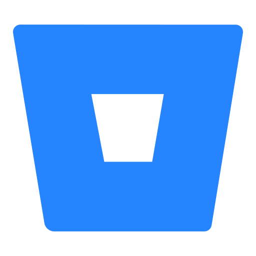

<h1 align="center"> Hey there! :wave: </h1>

I'm Cristiane but you can call me <strong>Kit</strong> :v: :smile: 

<h2>About me</h2>

- :earth_americas: I'm from <strong>Brazil - São Paulo </strong>current living in  <strong>Portugal</strong>
- :computer: and current working as a <strong>Junior Frontend developer </strong>
- :book: My background is as a process analyst for IT department for almost 6 years
- :heavy_check_mark: In 2019 I decided to change my career and did an <strong>Ironhack Web Development bootcamp</strong>
- :nerd_face: Since then I keep studying and realized that development world is a <strong>forever student life</strong>!

 
<h2>Tech Stack </h2>

 

 <h2>Tools</h2>

 

- Others

 

<h2>Studies</h2>

:heavy_check_mark: Next Level Week #04 (Rocketseat)  
:heavy_check_mark: Desafio React (Algaworks)  
:heavy_check_mark: Next Level Week #03 (Rocketseat)  
:heavy_check_mark: Frontend developer Bootcamp (IGTI)  
:heavy_check_mark: Next Level Week #02 (Rocketseat)  
:heavy_check_mark: Next Level Week #01 (Rocketseat)  
:heavy_check_mark: Web Development Bootcamp (Ironhack)  
:heavy_check_mark: Basic javascript (Origamid)  
:heavy_check_mark: Html5 and Css3 (Senac)  
:heavy_check_mark: Internet Systems Degree (Uninove)  
:heavy_check_mark: Multimedia Technician (Senac)
